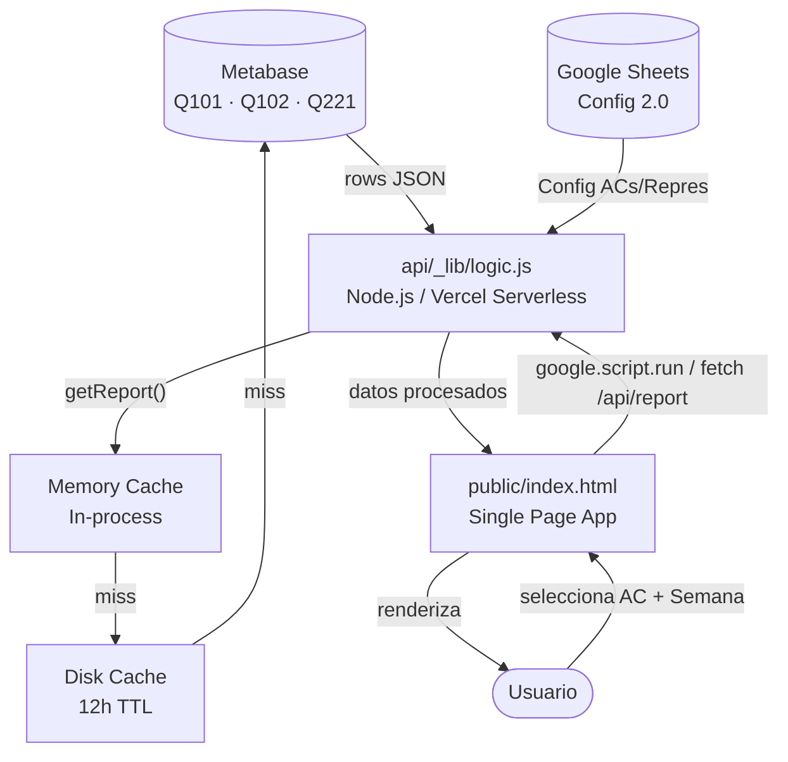
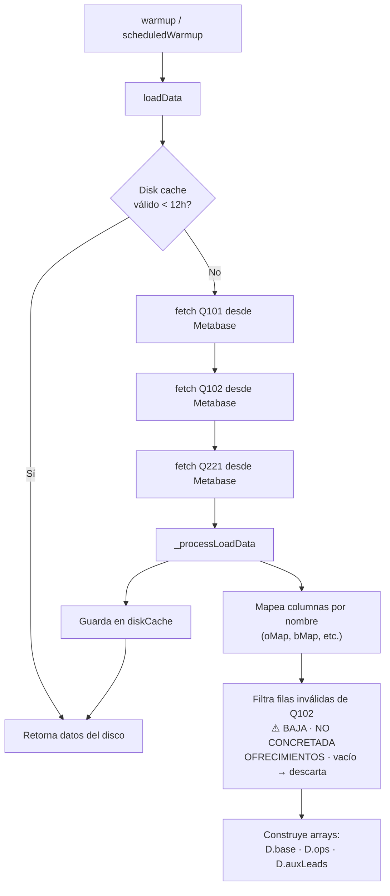
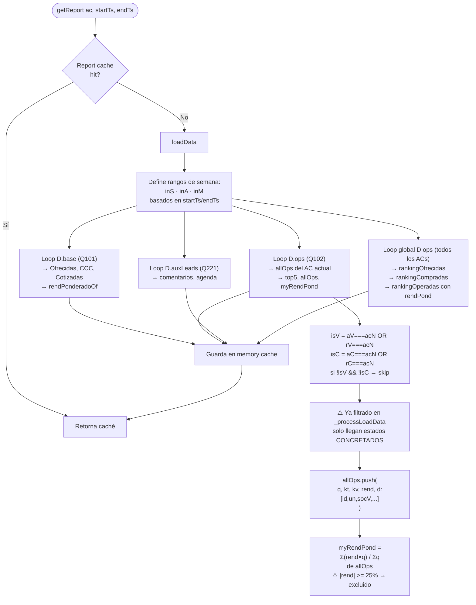
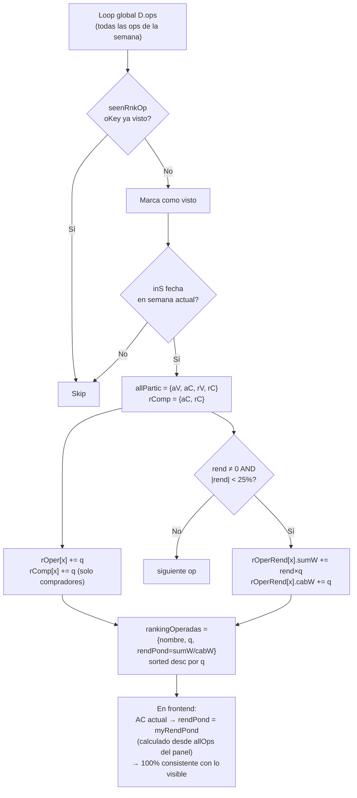
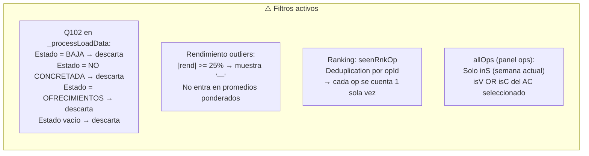
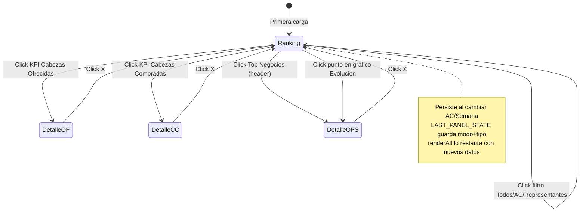
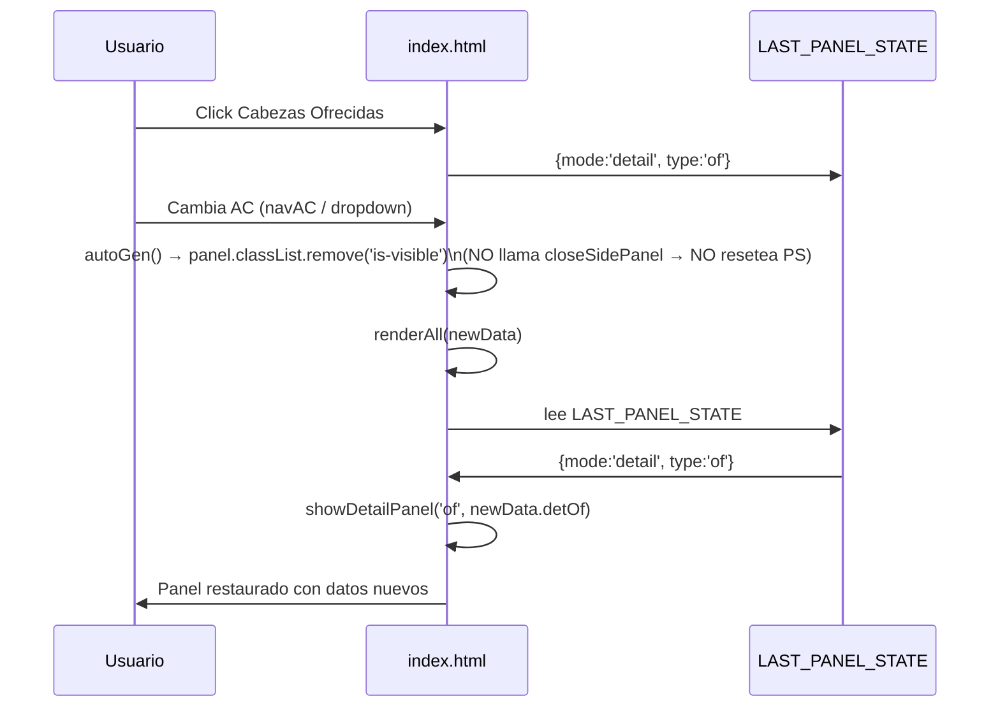
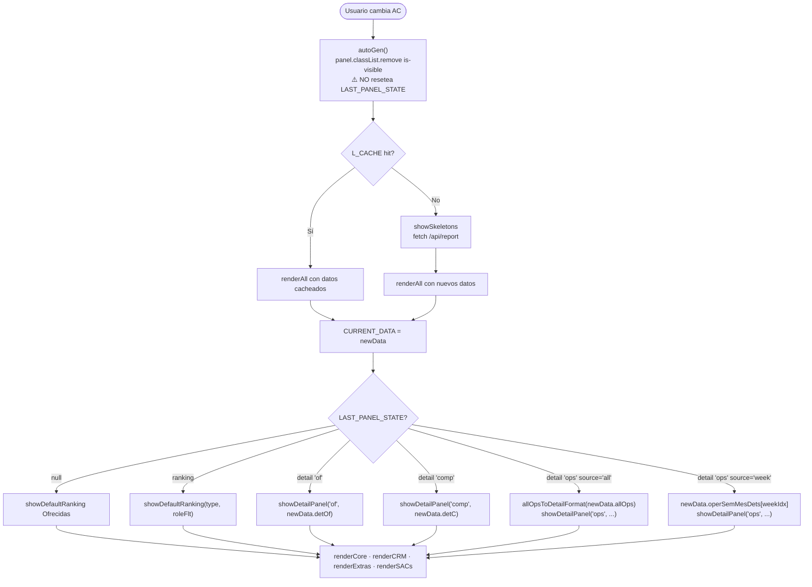

# 🗺️ Mapa del Proyecto — Reporte Semanal DCAC

> Documento vivo. Actualizar cuando cambien lógicas, filtros o estructura de datos.
> Última actualización: 2026-04-29

---

## 1. Arquitectura General



---

## 2. Fuentes de Datos (Metabase)

| Query | Nombre | Contenido | Uso |
|-------|--------|-----------|-----|
| **Q101** | Base Ofrecidas | Lotes publicados/ofrecidos. 1 fila por lote. Incluye estado, AC vendedor, cabezas, rend. | Ofrecidas, CCC, Cotizadas, Ranking Ofrecidas |
| **Q102** | Operaciones | Operaciones concretadas. 1 fila por op. Incluye AC vend/comp, repre vend/comp, Q, rend, estado. | Operadas, Compradas, Top Negocios, Ranking Operadas/Compradas |
| **Q221** | AuxLeads | Actividades CRM: comentarios, agenda. | Sección CRM, Socs. Gestionadas |

---

## 3. Flujo de Carga de Datos



---

## 4. Procesamiento del Reporte (getReport)



---

## 5. Cálculo del Ranking Semanal



---

## 6. Filtros de Datos Críticos



---

## 7. Estructura del Panel Lateral (Side Panel)



---

## 8. Fuentes de Datos para cada Vista del Panel

| Vista | Fuente de datos | Formato item |
|-------|----------------|--------------|
| Ranking Ofrecidas | `CURRENT_DATA.rankingOfrecidas` | `{nombre, q}` |
| Ranking Compradas | `CURRENT_DATA.rankingCompradas` | `{nombre, q}` |
| Ranking Operadas | `CURRENT_DATA.rankingOperadas` + patch `myRendPond` | `{nombre, q, rendPond}` |
| Detalle Ofrecidas | `CURRENT_DATA.detOf` | `{soc, est, cot, rend, q, kt, kv, un}` |
| Detalle Compradas | `CURRENT_DATA.detC` | `{soc, rend, q, kt, kv, un}` |
| Ops desde Top Negocios | `CURRENT_DATA.allOps` → `allOpsToDetailFormat()` | `{id, un, soc, fecha, q, kt, kv, lado, rend}` |
| Ops desde gráfico | `CURRENT_DATA.operSemMesDets[weekIdx]` | `{id, un, soc, fecha, q, kt, kv, lado, rend}` |
| Detalle Cargas | `CURRENT_DATA.detCarg` | `{soc, fecha, q, ...}` |

---

## 9. Persistencia del Estado del Panel (LAST_PANEL_STATE)



---

## 10. Flujo Completo: Cambio de AC



---

## 11. Campos Clave en arrays internos

### D.ops (por elemento, índice del array)
| Índice | Campo | Fuente Q102 |
|--------|-------|-------------|
| 0 | aV (AC vendedor normalizado) | asoc_com_vend |
| 1 | aC (AC comprador normalizado) | asoc_com_compra |
| 2 | f (fecha operación) | fecha_operacion |
| 4 | Q total | q |
| 5 | socV | rs_vendedora |
| 6 | socC | rs_compradora |
| 8 | ID operación | id |
| 9 | UN | un |
| 10 | Cat / Estado | estado |
| 18 | rV (repre vendedor) | repre_vendedor |
| 19 | rC (repre comprador) | repre_comprador |
| 20 | rend (decimal, ej: 0.039 = 3.9%) | rend |

### allOps (por item)
```
{ q, kt, kv, ktC, kvC, rend,
  d: [id, un, socV, acV, socC, acC, fecha, q, tieneCargar, lado] }
```

### operSemMesDets (formato para panel desde gráfico)
```
{ id, un, soc, fecha, q, kt, kv, lado, rend }
```

---

## 12. Consideraciones y Reglas de Negocio

> [!IMPORTANT]
> **Filtro de estados (Q102)**: Solo pasan operaciones con estado CONCRETADA (o equivalente). Estados descartados: BAJA, NO CONCRETADA, OFRECIMIENTOS, vacío. Este filtro se aplica en `_processLoadData` al construir `D.ops`.

> [!WARNING]
> **Rendimiento outliers**: Valores `|rend| >= 25%` se descartan de todos los promedios y se muestran como `—` en badges. Se considera dato erróneo en la fuente.

> [!NOTE]
> **Consistencia ranking vs panel**: El `rendPond` del AC actualmente seleccionado en el Ranking Operadas se reemplaza por `myRendPond` (calculado desde `allOps` del panel). Los demás ACs usan el cálculo global del ranking.

> [!NOTE]
> **Repre en operaciones**: Las ops donde el AC es `repre_vendedor` o `repre_comprador` (no AC directo) SÍ aparecen en su panel de operaciones. La condición es `isV = (aV===acN) OR (rV===acN)`.

> [!TIP]
> **KT/KV tags**: `kt` = categoría tipo (FAE VEND, FAE COMP, INV VEND, INV COMP, etc.), `kv` = valor numérico de la categoría. Estos se calculan con `getKtKv()` y determinan el color del badge.

---

## 13. Archivos Principales

```
reporte semanal vercel/
├── api/
│   ├── _lib/
│   │   ├── logic.js          ← NÚCLEO: toda la lógica de datos y cálculos
│   │   ├── cache.js          ← Memory cache con TTL
│   │   ├── diskCache.js      ← Disk cache (12h) para datos Metabase
│   │   └── blobCache.js      ← Vercel Blob storage (prod)
│   └── report.js             ← Endpoint serverless /api/report
├── public/
│   └── index.html            ← SPA completa: UI + JS + CSS inline
├── local-dev.js              ← Servidor Express local (puerto 4000)
├── vercel.json               ← Config Vercel: rutas + env
└── MAPA_PROYECTO.md          ← Este archivo ← MANTENER ACTUALIZADO
```
